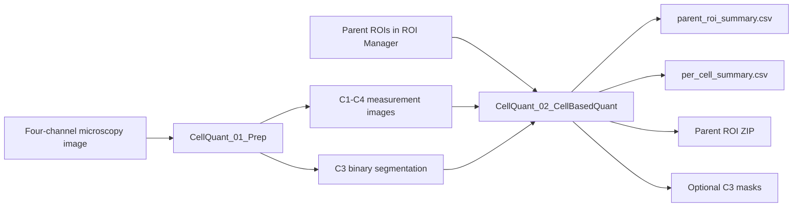

# Cell Quant Studio

A Fiji/ImageJ workflow for configurable four-channel microscopy preprocessing, channel 3-based cell segmentation, and parent-ROI-guided per-cell fluorescence quantification.


## Overview

Cell Quant Studio combines a Jython/Swing desktop interface with two ImageJ macro-language processing stages:

1. **Prep** converts a four-channel image into channel-specific measurement images and a binary channel 3 segmentation mask.
2. **Cell-based Quant** detects segmented cells within user-supplied parent ROIs, measures cell morphology, and extracts fluorescence intensity from channels 1-4.

The interface supports drag-and-drop image loading, active-image detection, output-folder selection, macro-path management, direct editing of both macro files, and one-click execution of Prep, Quant, or the complete sequence.

> [!IMPORTANT]
> The current workflow is designed for exactly four channels. Channel 3 is used for segmentation and is also measured as an intensity channel.

## Key capabilities

- Per-channel Max Z projection, Average Z projection, or selected-slice preparation
- Optional rolling-ball background subtraction, median filtering, and Gaussian blur
- Automatic or manual channel 3 thresholding
- Configurable threshold scaling, morphology, hole filling, and watershed separation
- Particle filtering by area and circularity within each parent ROI
- Optional exclusion of edge-touching particles
- Cell shape measurements: area, perimeter, circularity, Feret diameter, and bounds
- Mean intensity and integrated density measurements for channels 1, 2, 3, and 4
- Timestamped result folders containing CSV exports, the original parent ROI archive, and optional per-parent channel 3 mask images
- Editable macro settings and reusable session-path files from the graphical interface

## Workflow



## Requirements

- Fiji with ImageJ version 1.53 or later
- Fiji's Jython scripting support for the graphical launcher
- An input image readable by the installed Fiji/ImageJ environment
- Exactly four image channels
- One or more parent ROIs loaded in ROI Manager before running Quant or Run All

Fiji scripting documentation:

- [Scripting in ImageJ](https://imagej.net/scripting/)
- [Jython scripting](https://imagej.net/scripting/jython/)
- [Fiji Script Editor](https://imagej.net/scripting/script-editor)

## Repository files

| File | Purpose |
| --- | --- |
| `CellQuantStudio.py` | Jython/Swing graphical launcher and macro editor |
| `CellQuant_01_Prep.ijm` | Four-channel preprocessing and channel 3 segmentation |
| `CellQuant_02_CellBasedQuant.ijm` | Parent-ROI-guided particle detection and per-cell quantification |
| `README.md` | Installation, operation, settings, outputs, and limitations |

## Installation

### Recommended menu installation

Fiji discovers scripts placed under its `scripts` directory. For a zero-configuration installation, place the three processing files together and use the following installed names:

```text
Fiji.app/
└── scripts/
    └── Plugins/
        ├── Cell_Quant_Studio.py
        ├── CellQuant_01_Prep.ijm
        └── CellQuant_02_Quant.ijm
```

Apply these two filename changes when copying the supplied files:

```text
CellQuantStudio.py                  -> Cell_Quant_Studio.py
CellQuant_02_CellBasedQuant.ijm    -> CellQuant_02_Quant.ijm
```

The underscores in `Cell_Quant_Studio.py` allow Fiji to expose the launcher as **Plugins > Cell Quant Studio**. The quantification rename matches the launcher's automatic macro-path lookup. Restart Fiji or select **Help > Refresh Menus** after installing the files. Fiji also recognizes scripts under `Fiji.app/plugins/Scripts/` and its subdirectories.

### Installation without renaming

The original filenames can be retained. Open `CellQuantStudio.py` in Fiji's Script Editor and run it, then use the **Macro paths** tab to select:

- `CellQuant_01_Prep.ijm`
- `CellQuant_02_CellBasedQuant.ijm`

The selected paths can be stored in a Cell Quant Studio session file.

## Quick start

1. Open Fiji and launch Cell Quant Studio from the Plugins menu or Script Editor.
2. Open the four-channel microscopy image by dragging it into the drop zone, browsing to it, or using **Detect active image** for an image already open in Fiji.
3. Confirm that the detected image has four channels and review its dimensions, Z slices, frames, bit depth, and calibration.
4. Open ROI Manager and load or create the parent area ROIs that define the regions to analyze.
5. Choose an output folder. If left empty, the launcher attempts to use the input image's folder.
6. Confirm both macro paths in the **Macro paths** tab.
7. Review or edit processing settings in the **Prep settings** and **Quant settings** tabs.
8. Select **Run All** to execute Prep followed by Quant, or run either stage separately.
9. Review the timestamped run folder created inside the selected output folder.

> [!CAUTION]
> Running Prep or Quant saves the current editor contents back to the macro path before execution. Keep the repository under version control so parameter and code changes can be reviewed and recovered.

## Input assumptions

Cell Quant Studio assumes that:

- The input is a four-channel image or hyperstack.
- All channels share the same image dimensions and coordinate system.
- Channel 3 contains the signal used to identify cells or objects.
- Parent ROIs are defined in full-image coordinates and align with the prepared images.
- Particle-size and threshold settings have been validated for the image calibration and biological preparation.

## Processing stages

### 1. Prep

`CellQuant_01_Prep.ijm` validates the four-channel input and creates the following in-memory images:

```text
<base>_C1_MEAS
<base>_C2_MEAS
<base>_C3_MEAS
<base>_C4_MEAS
<base>_C3_SEG
```

Each measurement channel can be processed independently. The exact supported projection mode strings are:

| Value | Behavior |
| --- | --- |
| `"Max"` | Max-intensity Z projection when more than one Z slice is present |
| `"Average"` | Average-intensity Z projection when more than one Z slice is present |
| Any other value, normally `"Slice"` | Duplicate the configured Z slice |

After projection or slice selection, each channel can receive optional background subtraction, median filtering, and Gaussian blur.

The channel 3 measurement image is duplicated for segmentation. Segmentation can use either a manual threshold or an ImageJ automatic threshold method. The lower automatic threshold can be scaled before conversion to a binary mask. Optional morphology includes Open, Close, Erode, Dilate, Fill Holes, and Watershed.

### 2. Cell-based Quant

`CellQuant_02_CellBasedQuant.ijm` requires the five prepared images to be open and requires the parent ROI set to be loaded in ROI Manager.

For each parent ROI, the macro:

1. Saves and restores the original parent ROI set.
2. Crops the channel 3 segmentation to the parent ROI bounding box.
3. Clears pixels outside the actual parent ROI shape.
4. Optionally applies watershed to the cropped mask.
5. Runs Analyze Particles using the configured area and circularity limits.
6. Converts detected child-cell ROIs from crop-local coordinates back to full-image coordinates.
7. Measures cell morphology on the channel 3 segmentation image.
8. Measures mean intensity and integrated density on channels 1-4.
9. Appends parent-level and cell-level records to CSV files.

## Configuration reference

### Per-channel Prep settings

The same setting pattern is available for channels 1-4. Replace `N` with the channel number.

| Setting | Description |
| --- | --- |
| `cNPrepMode` | Exact mode string: `Max`, `Average`, or a slice-mode value such as `Slice` |
| `cNSlice` | One-based Z slice used in slice mode; values are clamped to the available Z range |
| `cNDoSubtractBackground` | `1` enables rolling-ball background subtraction; `0` disables it |
| `cNBgRadius` | Rolling-ball radius |
| `cNMedianRadius` | Median-filter radius; values greater than zero enable the filter |
| `cNGaussianSigma` | Gaussian sigma; values greater than zero enable the blur |

### Channel 3 segmentation settings

| Setting | Description |
| --- | --- |
| `c3ThresholdMethod` | ImageJ automatic threshold method, for example `Otsu` |
| `c3ThresholdMode` | Values beginning with `dark` append ImageJ's dark-background threshold option |
| `c3ThresholdScale` | Multiplier applied to the automatic lower threshold |
| `c3UseManualThreshold` | `1` uses manual limits; `0` uses automatic thresholding |
| `c3ManualLow` | Manual lower threshold |
| `c3ManualHigh` | Manual upper threshold |
| `c3DoOpen` | Apply binary Open |
| `c3DoClose` | Apply binary Close |
| `c3DoErode` | Apply binary Erode |
| `c3DoDilate` | Apply binary Dilate |
| `c3FillHoles` | Fill holes in binary objects |
| `c3DoWatershed` | Apply watershed separation to the final segmentation mask |

### Quantification settings

| Setting | Description |
| --- | --- |
| `c1MeasTitle` through `c4MeasTitle` | Optional explicit prepared-window titles; empty values trigger automatic resolution |
| `c3SegTitle` | Optional explicit channel 3 segmentation-window title |
| `c3ParticleSizeMin` | Minimum particle area accepted by Analyze Particles |
| `c3ParticleSizeMax` | Maximum particle area accepted by Analyze Particles |
| `c3CircularityMin` | Minimum circularity, from 0.00 to 1.00 |
| `c3CircularityMax` | Maximum circularity, from 0.00 to 1.00 |
| `c3ExcludeEdgeParticles` | `1` excludes particles touching the crop boundary |
| `c3ApplyWatershedToCrop` | `1` applies watershed separately inside each parent crop |
| `saveParentMaskImages` | `1` saves generated channel 3 parent-mask TIFF files |
| `decimalPlaces` | Decimal precision requested from ImageJ measurements |
| `defaultOutputDir` | Fallback output folder when no `outputDir` argument is supplied |

## Output structure

Every Quant execution creates a new folder named from the sanitized image base and an ImageJ timestamp:

```text
<output-root>/
└── <sanitized-base>_<timestamp>/
    ├── Parent_ROIs_Input.zip
    ├── parent_roi_summary.csv
    ├── per_cell_summary.csv
    └── C3_CellMasks/
        ├── <base>_ROI_01_C3_mask.tif
        ├── <base>_ROI_02_C3_mask.tif
        └── ...
```

The `C3_CellMasks` directory is created for every run. TIFF masks are written only when `saveParentMaskImages = 1` and ImageJ generates a mask window for the corresponding parent ROI.

### `Parent_ROIs_Input.zip`

A copy of the parent ROI Manager contents saved at the beginning of the run. This preserves the spatial regions used for that execution.

### `parent_roi_summary.csv`

One row per parent ROI, including:

- Run name, image base, and timestamp
- Parent ROI index, generated label, and bounding box
- Image dimensions and pixel calibration
- Resolved measurement and segmentation window titles
- Particle-analysis settings
- Detected cell count
- Total detected channel 3 particle area
- Saved parent-mask path, when available

Parent labels in the CSV are generated in processing order as `ROI_01`, `ROI_02`, and so on. Original ROI names remain available in `Parent_ROIs_Input.zip`.

### `per_cell_summary.csv`

One row per detected cell, including:

- Parent ROI index and generated parent label
- Cell index within the parent ROI
- Run-wide global cell ID
- Parent and cell bounding boxes
- Coordinate fields exported as `Centroid_X` and `Centroid_Y` (see the measurement note below)
- Area, perimeter, circularity, and Feret diameter
- Mean intensity and integrated density for channels 1-4

> [!WARNING]
> **Coordinate-field validation:** the current Quant macro enables ImageJ's `centroid` measurement but reads result columns `XM` and `YM` into CSV fields named `Centroid_X` and `Centroid_Y`. ImageJ uses `X` and `Y` for geometric centroid and `XM` and `YM` for center of mass. Because center-of-mass measurement is not enabled by the current `Set Measurements` command, validate or correct these two exported fields before relying on them. The other documented shape and intensity fields are read from the columns enabled by the macro.

## Window lifecycle

Prep closes its internal temporary projection and slice windows but leaves the five prepared images open for Quant. The original source image is closed only when `closeSourceAfterPrep = 1` and the Prep macro opened that source from `imagePath`.

Quant closes temporary parent crops and generated mask windows after each parent ROI, restores the original parent ROI set, and leaves the prepared measurement and segmentation images open.

> [!WARNING]
> **Run All depends on the five prepared images remaining open between Prep and Quant.** A Prep variant that closes all image windows at the end is not compatible with the current Run All architecture. Global image cleanup should occur only after Quant has finished and written its outputs, unless the workflow is changed to save and reopen intermediate images.

## Running macros directly

The graphical launcher is optional.

### Prep argument

Prep can process the active image or receive an image path through the macro argument string:

```text
imagePath=/absolute/path/to/four_channel_image.tif
```

### Quant argument

Quant can receive an output directory through the macro argument string:

```text
outputDir=/absolute/path/to/results
```

When no output directory is supplied and `defaultOutputDir` is empty, Quant opens a folder-selection dialog.

## Session files

**Save session** writes the graphical interface fields as `key=value` lines. A session file records image, output, and macro paths. It does not embed image data, ROI data, or complete macro source code.

Macro settings are persisted by saving the editor contents to the selected `.ijm` files.

## Troubleshooting

### Quant macro path is not populated automatically

The supplied quantification file is named `CellQuant_02_CellBasedQuant.ijm`, while the launcher searches automatically for `CellQuant_02_Quant.ijm` or `Run.ijm`. Either:

- Select `CellQuant_02_CellBasedQuant.ijm` manually in **Macro paths**, or
- Rename it to `CellQuant_02_Quant.ijm`.

### Prep reports a channel-count error

The Prep macro requires exactly four channels. Confirm that the image was opened as a four-channel hyperstack rather than as an RGB image, a single-channel stack, or separate windows.

### Quant reports that ROI Manager is missing or empty

Open ROI Manager and load at least one parent ROI before running Quant or Run All.

### Quant cannot resolve measurement or segmentation windows

Run Prep first and keep these exact prepared windows open:

```text
<base>_C1_MEAS
<base>_C2_MEAS
<base>_C3_MEAS
<base>_C4_MEAS
<base>_C3_SEG
```

Do not rename or close them before Quant.

### Too few, too many, or merged cells are detected

Inspect the channel 3 segmentation and adjust:

- Threshold method, mode, scale, or manual limits
- Prep morphology and watershed
- Quant crop-level watershed
- Particle area range
- Circularity range
- Edge-particle exclusion

### Intensity values are unexpected

Verify channel assignments, projection modes, selected slices, image calibration, bit depth, background subtraction, and filtering settings. Compare measurements against manually selected test cells before analyzing a full experiment.

## Reproducibility recommendations

- Commit the `.ijm` files used for each experiment.
- Tag software releases and record the release identifier in laboratory records.
- Keep the generated run folder intact, including the ROI ZIP and both CSV files.
- Validate thresholds and particle filters on representative images before batch-scale use.
- Include positive and negative controls where biologically appropriate.
- Review segmentation overlays or masks rather than relying on counts alone.
- Preserve original, unmodified image data separately from analysis outputs.

## Current limitations

- Exactly four channels are required.
- Segmentation is fixed to channel 3.
- The analysis is based on 2D projected or selected-slice images.
- Parent area ROIs must be prepared externally in ROI Manager; line and point ROIs are not appropriate inputs for the crop-and-particle workflow.
- The interface processes one selected image at a time and does not provide a batch queue.
- Prepared measurement images are not saved automatically.
- The current workflow is implemented as scripts and macros rather than a compiled Java plugin or Fiji update site.
- No automated test suite or validation dataset is included in the supplied repository files.
- The launcher's prepared-window activation helper searches legacy suffixes rather than the current `_C1_MEAS` through `_C4_MEAS` and `_C3_SEG` names. Prep normally leaves `_C3_SEG` active, but manual Quant runs should explicitly activate a prepared image.
- The launcher does not automatically detect the supplied `CellQuant_02_CellBasedQuant.ijm` filename unless it is selected manually or renamed to `CellQuant_02_Quant.ijm`.

## Research-use notice

Cell Quant Studio is intended for research image analysis. It is not a clinical diagnostic system. Users are responsible for validating segmentation, measurement settings, calibration, and statistical interpretation for their own imaging platform and biological application.

## Contributing

Issues and pull requests should include:

- Fiji/ImageJ version
- Operating system
- Input image dimensions, channel count, Z slices, frames, and bit depth
- Relevant Prep and Quant settings
- Exact error text or a minimal reproducible example
- A de-identified sample image when redistribution is permitted

Avoid committing proprietary or identifiable microscopy data to a public repository.

## Citation

No formal software citation or DOI is defined in the supplied source files. For publication use, create a versioned GitHub release and archive it with a service such as Zenodo, then add the resulting citation and DOI here.

Suggested citation format:

```text
Ivan Khimach. 2026. Cell Quant Studio (Version 1.0.0)
```

## License

No software license is specified in the supplied source files. Add a `LICENSE` file and update this section before public distribution.

## Acknowledgments

Cell Quant Studio is built on Fiji, ImageJ, the ImageJ macro language, SciJava scripting, Jython, and Java Swing.
